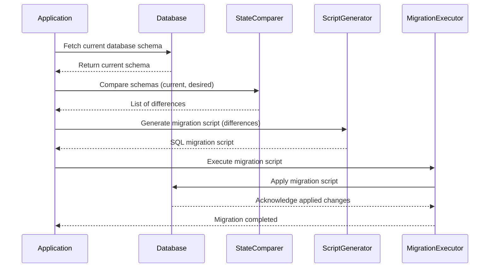

```mermaid
sequenceDiagram
    participant App as Application
    participant DB as Database
    participant StateComparer as StateComparer
    participant ScriptGenerator as ScriptGenerator
    participant MigrationExecutor as MigrationExecutor

    App->>DB: Fetch current database schema
    DB-->>App: Return current schema
    App->>StateComparer: Compare schemas (current, desired)
    StateComparer-->>App: List of differences
    App->>ScriptGenerator: Generate migration script (differences)
    ScriptGenerator-->>App: SQL migration script
    App->>MigrationExecutor: Execute migration script
    MigrationExecutor->>DB: Apply migration script
    DB-->>MigrationExecutor: Acknowledge applied changes
    MigrationExecutor-->>App: Migration completed
```