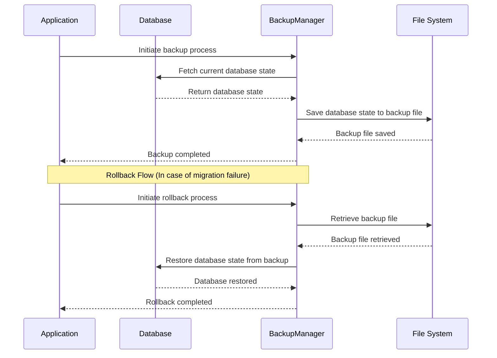

```mermaid
sequenceDiagram
    participant App as Application
    participant DB as Database
    participant BackupManager as BackupManager
    participant FileSys as File System

    App->>BackupManager: Initiate backup process
    BackupManager->>DB: Fetch current database state
    DB-->>BackupManager: Return database state
    BackupManager->>FileSys: Save database state to backup file
    FileSys-->>BackupManager: Backup file saved
    BackupManager-->>App: Backup completed

    Note over App,BackupManager: Rollback Flow (In case of migration failure)
    App->>BackupManager: Initiate rollback process
    BackupManager->>FileSys: Retrieve backup file
    FileSys-->>BackupManager: Backup file retrieved
    BackupManager->>DB: Restore database state from backup
    DB-->>BackupManager: Database restored
    BackupManager-->>App: Rollback completed

```