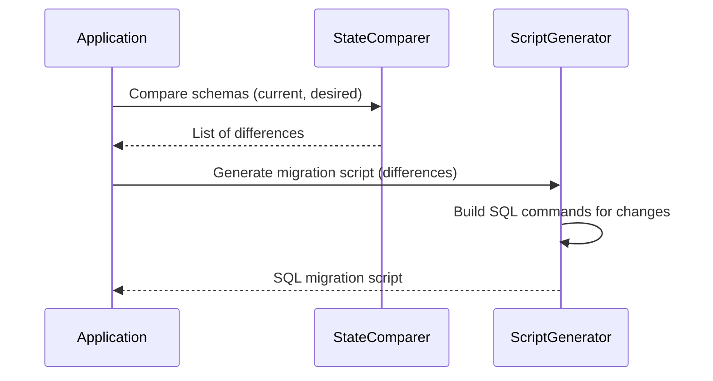

```mermaid
sequenceDiagram
    participant App as Application
    participant StateComparer as StateComparer
    participant ScriptGenerator as ScriptGenerator

    App->>StateComparer: Compare schemas (current, desired)
    StateComparer-->>App: List of differences
    App->>ScriptGenerator: Generate migration script (differences)
    ScriptGenerator->>ScriptGenerator: Build SQL commands for changes
    ScriptGenerator-->>App: SQL migration script

```